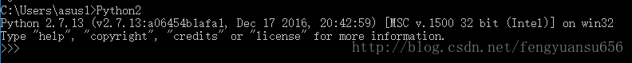

应用

> **git图形化统计工具 - windows下gitstats的安装和使用**https://blog.csdn.net/fengyuansu656/article/details/72771178

##### 1、安装

windows安装

##### 2、配置到path

D:\Programs\Python\Python27-13

D:\Program Files\gnuplot\bin

##### 3、执行命令

python D:\\a\\github\\gitstats\\gitstats.py D:\a\java\bj-telecom\document D:\a\java\bj-telecom\document

##### 其他参考：

安装

 gitstats 依赖 Git 、Python2 以及Gnuplot。

 以下是最新的依赖版本。

 \- Python (>= 2.6.0)

 \- Git (>= 1.5.2.4)

 \- Gnuplot (>= 4.0.0)

 

 **1. gitstats**

 可以从 https://github.com/hoxu/gitstats下载gitstats ，或者用 https://github.com/hoxu/gitstats.git在git中拉取。值得一提的是，在win下使用，要把gitstats工程里的gitstats文件重命名成gitstats.py。

 **2. Python2**

 由于只支持Python2，可以到 https://www.python.org/downloads/release/python-2713/，获取python2的win下的安装包。

 安装完以后需要配置环境变量，例如安装在C:\Python27 ，则在环境变量path中增加C:\Python27。

 为了避免多个python冲突，把python安装目录下的python.exe修改为python2.exe。

 可以在cmd中输入python2 ，看是否配置成功。

 **3. Gnuplot**

 可以到 https://sourceforge.net/projects/gnuplot/files/gnuplot/5.0.6/下载5.0.6版本，选择win版本即可。

 安装完毕后，根据README-Windows.txt里描述，需要配置环境变量，配置到安装目录的bin下，例如D:\gnuplot\bin，同样的，在环境变量path中增加。

 配置完成后，可以在cmd中输入gnuplot验证。

 
 

 使用

 在cmd中使用python执行gitstats中的gitstats.py。

 命令如下：python2 [gitstats.py路径] [git库路径] [输出结果路径]

 eg:

 python2 E:\git\gitstats\gitstats.py E:\git\myTestGit E:\git\git_result

 
 

 然后等待窗口执行完毕，在输出结果路径里找index.html，打开即可查看详细输出结果。